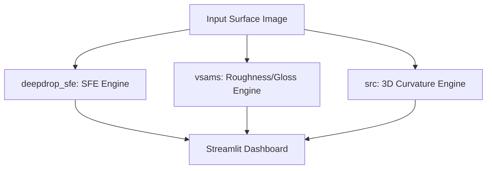
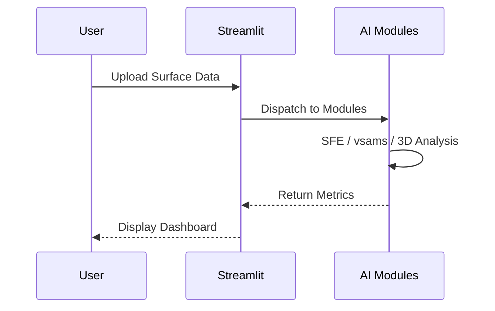

# 통합 표면 분석 플랫폼 (Integrated Surface Analysis Platform)

   

라이브 데모 배포 주소: [https://sg-integration-2-3-7.streamlit.app/](https://sg-integration-2-3-7.streamlit.app/)

본 프로젝트는 표면 자유 에너지(SFE) 분석, 표면 마감 상태(조도/광택도) 평가, 3D 지형 및 곡률 분석 기능을 하나의 인터페이스로 제공하는 통합 제어 솔루션입니다.

## Technical Architecture & Workflow

### Architecture Diagram

### Sequence Diagram



## 아키텍처 및 구성

프로젝트는 다음의 구조로 결합되어 구동됩니다:

- deepdrop_sfe: SFE 측정을 담당하며, 2개 액체의 접촉각 및 OWRK 계산을 수행합니다.
- vsams: 금속 표면의 동전 반사상을 기반으로 조도(Ra), 광택도, 마감 유형을 분석합니다.
- src: 3D 심도 및 곡률 연산(가우시안 곡률 K 및 최소 곡률 반경 R)을 담당합니다.
- app.py: 전체 기능을 통합 탭 레이아웃 및 다국어 지원으로 시각화하는 Streamlit 메인 대시보드입니다.

## 구동 요구 사항

- Python 3.10.6 이상
- CUDA 12.x 및 NVIDIA GPU 환경 (RTX 5080 가속 대응)
- 추가 패키지 의존성 (requirements.txt 명세)

## 모델 가중치 다운로드

본 저장소는 용량 제한으로 인해 AI 모델 가중치 파일을 포함하지 않습니다.
아래 Google Drive 링크에서 3개의 폴더를 내려받아 프로젝트 루트에 배치해야 합니다.

다운로드 링크: https://drive.google.com/drive/folders/1ES59vdjTOlXB0Qmz4bv8z1l30RVKcYOo?usp=sharing

### 배치 경로

다운로드 후 프로젝트 루트 기준으로 다음과 같이 배치합니다.

```
SG_integration_002+003+007/
+-- checkpoints/
|   +-- mobile_sam.pt            (SAM 세그멘테이션 - SFE 분석용)
|   +-- v_sams_model.pth         (V-SAMS 표면 마감 분류 모델)
+-- models/
|   +-- depth_anything_v2/
|   |   +-- depth_anything_v2_vits.pth  (Depth-Anything-V2 깊이 추정 모델)
|   +-- sam2/
|       +-- sam2_hiera_small.pt         (SAM 2.1 세그멘테이션 - 3D 곡률용)
+-- vsams/
    +-- data/
        +-- visual_library.pth   (V-SAMS 시각 참조 라이브러리)
```

> vsams/data/ 폴더는 저장소에 이미 존재하지만, visual_library.pth 파일은 Google Drive의 vsams 폴더 안에서 별도로 내려받아 해당 경로에 직접 배치해야 합니다.

가중치 파일이 모두 배치되지 않으면 앱 실행 시 모델 로드 단계에서 오류가 발생합니다.

## 실행 방법

### 1. 로컬 환경으로 구동 시

프로젝트 루트 디렉토리에서 가상환경을 생성 및 활성화한 후, 필수 패키지를 설치하고 실행합니다.

```bash
# 가상환경 생성 및 활성화 (Windows)
python -m venv .venv
.venv\Scripts\activate

# 패키지 설치
pip install -r requirements.txt

# 앱 실행
streamlit run app.py
```

### 2. Docker를 이용한 컨테이너 구동 시

Docker 및 NVIDIA Container Toolkit이 설치되어 있는 경우 다음 명령어로 GPU 가속 기반 실행을 지원합니다.

빌드 및 구동 명령어:
docker compose up --build -d

포트 8501을 통해 웹 브라우저에서 대시보드에 접근할 수 있습니다.

## CI/CD 파이프라인

본 프로젝트는 GitHub Actions를 활용한 지속적 통합(CI) 및 지속적 제공(CD) 파이프라인이 구성되어 있습니다.

### 1. 주요 워크플로우 구성 (.github/workflows/ci.yml)

- **코드 품질 및 구문 확인 (Lint & Import Test)**: 코드 푸시 또는 풀 리퀘스트 생성 시 ruff 검사 및 pytest를 통한 핵심 모듈 임포트 결합 테스트를 자동으로 수행합니다.
- **도커 빌드 검증 (Docker Build Validation)**: Dockerfile이 오류 없이 정상 빌드되는지 임시 빌드를 통해 검증합니다.
- **자동 이미지 배포 (Docker Image CD)**: main 또는 master 브랜치에 코드가 병합될 때 GitHub Container Registry (GHCR)에 최신 이미지를 자동 빌드 및 배포하도록 설계되어 있습니다. (기본적으로 비활성화 상태이며 주석을 해제하여 활성화합니다.)

### 2. CD 파이프라인 활성화 및 가이드

자동 배포 기능을 사용하려면 GitHub 저장소에서 다음 설정을 완료해야 합니다.

1. **워크플로우 주석 해제**:
   - .github/workflows/ci.yml 파일 하단의 deploy-ghcr 작업 부분 주석을 해제합니다.
2. **저장소 권한 설정**:
   - GitHub 저장소 설정 (Settings) > Actions > General > Workflow permissions 항목으로 이동합니다.
   - Read and write permissions 옵션을 활성화하여 워크플로우가 GHCR에 패키지를 생성 및 푸시할 수 있도록 권한을 설정합니다.
3. **이미지 확인**:
   - 성공적으로 푸시된 도커 이미지는 GitHub 프로필 또는 조직의 Packages 탭에서 확인 및 내려받기(pull)할 수 있습니다.

